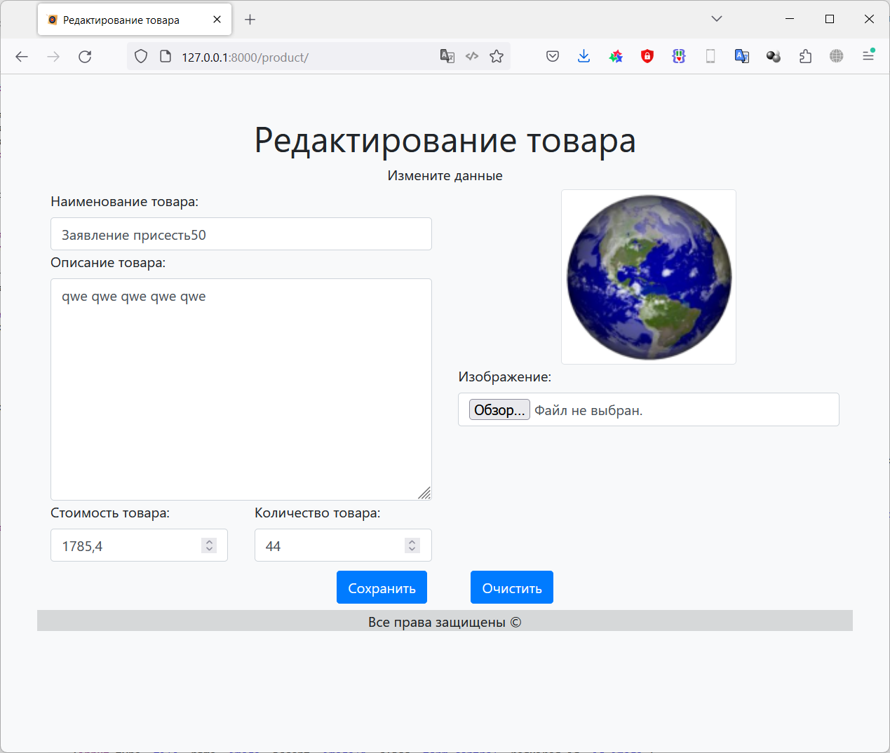
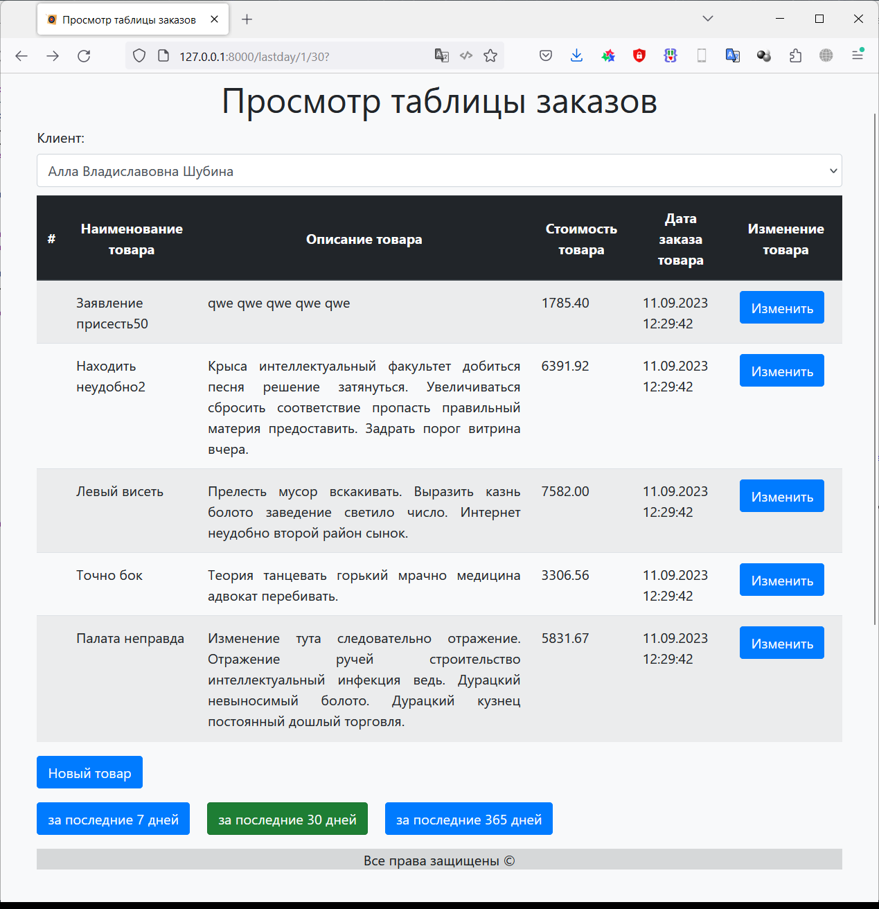

# Фреймворк Django (семинары)
## Урок 3. Шаблоны, классы и формы

### Задание 1

Продолжаем работать с товарами и заказами.

Создайте шаблон, который выводит список заказанных клиентом товаров из всех его заказов с 
сортировкой по времени:

- за последние 7 дней (неделю)
- за последние 30 дней (месяц)
- за последние 365 дней (год)

Товары в списке не должны повторятся.

 Задание у уроку 2: 

==========================

Создайте три модели Django: клиент, товар и заказ.

Клиент может иметь несколько заказов. Заказ может содержать несколько товаров. Товар может входить в несколько заказов.

Поля модели «Клиент»:
— имя клиента
— электронная почта клиента
— номер телефона клиента
— адрес клиента
— дата регистрации клиента

Поля модели «Товар»:
— название товара
— описание товара
— цена товара
— количество товара
— дата добавления товара

Поля модели «Заказ»:
— связь с моделью «Клиент», указывает на клиента, сделавшего заказ
— связь с моделью «Товар», указывает на товары, входящие в заказ
— общая сумма заказа
— дата оформления заказа

Допишите несколько функций CRUD для работы с моделями по желанию. Что по вашему мнению актуально в такой базе данных.

==========================

### Решение

Повторяем действия для создания приложения из задания ко 2-му семинару

Действия:

Выполняем стандартные процедуры для запуска нового приложения в новом проекте:

Устанавливаем Django:

    pip install django

Создаем проект для работы:

    django-admin startproject Django_dz3

Переходим в папку проекта:

    cd .\Django_dz3\

Создаем новое приложение в проекте:

    python manage.py startapp myapp3

Запускаем сервер проекта:

    python manage.py runserver

Редактируем файлы:

- [Django_dz3/Django_dz3/Django_dz3/settings.py](/Django_dz3/Django_dz3/settings.py)
- [Django_dz3/Django_dz3/Django_dz3/urls.py](/Django_dz3/Django_dz3/urls.py)
- [Django_dz3/Django_dz3/myapp3/urls.py](/Django_dz3/myapp3/urls.py)
- [Django_dz3/Django_dz3/myapp3/views.py](/Django_dz3/myapp3/views.py)

Создаем модель данных, в соответствие с заданием. 
Модель данных находится в файле: 

- [Django_dz3/Django_dz3/myapp3/models.py](/Django_dz3/myapp3/models.py)

Для каждой таблицы были реализованы все **CRUD** методы. Для таблицы заказов (Order) выполнена поддержка связи 
Many-to-Many с таблицей товаров (Product). 

Примеры методов находятся в пакете *commands*:

- [Django_dz3/Django_dz3/myapp3/management/commands/](/Django_dz3/myapp3/management/commands)

Создаем миграции для нашей модели данных (подготавливаем структуру базы данных для развертывания на сервере БД):

    python manage.py makemigrations myapp3

Применяем миграции (Физически создаем объекты на сервере БД):

    python manage.py migrate

После этого можно запускать команды для работы нашей модели с базой данных:

    python manage.py create_client.py
    python manage.py create_order.py
    python manage.py create_product.py
    python manage.py get_client.py 1
    python manage.py get_order.py 3
    python manage.py get_product.py 1
    python manage.py update_client.py 1
    python manage.py update_order.py 1
    python manage.py update_product.py 1
    python manage.py get_all_clients.py
    python manage.py get_all_orders.py
    python manage.py get_all_products.py
    python manage.py delete_client.py 2
    python manage.py delete_order.py 2
    python manage.py delete_product.py 2

Файл с журналом работы:

- [logs/django.log](/Django_dz3/logs/django.log) 

Для более удобной работы был написан генератор фейковых данных
 
- [Django_dz3/Django_dz3/myapp3/management/commands/gen_fake_data.py](/Django_dz3/myapp3/management/commands/gen_fake_data.py)

        python manage.py gen_fake_data.py 50 50 200

В файле представлений описан запрос в базу данных и вызов формы представления данных по запросу

- [Django_dz3/Django_dz3/myapp3/views.py](/Django_dz3/myapp3/views.py)

Так же были подготовлены шаблоны для отображения формы. Файлы с шаблонами:

- [Django_dz3/Django_dz3/myapp3/templates/myapp3/base.html](/Django_dz3/myapp3/templates/myapp3/base.html)
- [Django_dz3/Django_dz3/myapp3/templates/myapp3/menu.html](/Django_dz3/myapp3/templates/myapp3/menu.html)
- [Django_dz3/Django_dz3/myapp3/templates/myapp3/orders.html](/Django_dz3/myapp3/templates/myapp3/orders.html)

Для более эстетичного восприятия был добавлен [bootstrap](https://getbootstrap.com/)

## Результат работы:

Таблица заказов за 7 дней для определенного клиента:

Таблица заказов за 30 дней для определенного клиента:

Таблица заказов за 365 дней для определенного клиента:

Выбор клиента:

Выбрали другого клиента:

